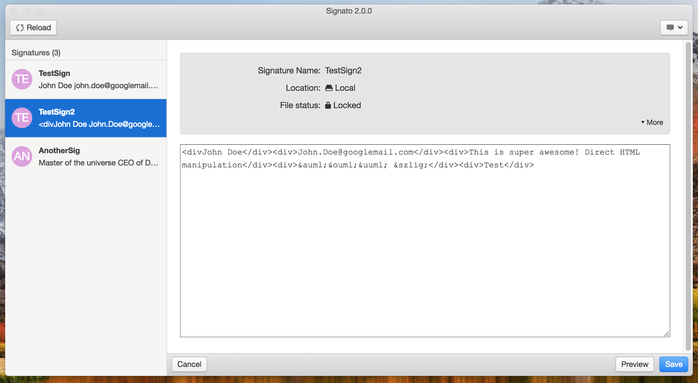

> :warning: **Warning** This tool is no longer actively maintained. It can still work and PRs might be merged, however no bugs will be fixed or support for later macOS versions added

# Signato

Easily install HTML signatures in Apple Mail without fiddling around in hidden folders 😍

# Introduction

This is a GUI version of the [signato](https://github.com/Nolanus/signato) script to easily install plain HTML signatures in Apple Mail.

## Prerequisite

Create your HTML signature. Notice the [limited support of certain CSS techniques in mail clients](https://www.campaignmonitor.com/css/) and place only the `body` tag and it's children in your signature HTML file for Apple Mail. Inline all style attributes, probably using a tool like [CSS Inliner](https://inliner.cm/).

Open Apple Mail, create a new signature and remember the name.

## Download

Precompiled/prepacked builds of signato that are ready to run on macOS can be found in the [releases section](https://github.com/Nolanus/signato-app/releases).

## Usage

Apple Mail should always be closed when using signato, as it directly manipulates files used by Apple Mail.

Open the signato app and locate the signature you want to adjust in the left-hand list. Select it and adjust the content as desired. Hit save at the bottom to write the changes to disk.

## FAQ

### I can't adjust the signature in Apple Mail after installing it!

For local signatures the respective file on your disk will be locked to prevent Apple Mail from reverting the content change. As a consequence you are not capable of editing HTML signature installed with signato via the settings menu in Apple Mail any longer (other signatures will work fine).

Use signato to adjust the contents of the locked signatures. To unlock a signature file select it in signato and locate the icon next to the "File status". Hold down the "alt" key and click the lock icon to toggle the file lock state. This (un)locks the file immediately. It's not necessary to press the save button.  

### I can't delete the signature!

To properly delete the signature the file must be unlocked. Close Apple Mail. Open signato and unlock the signature file as described in the previous FAQ answers. You may now open Apple Mail again and delete the signature using the "minus" button in the settings.

### How to create or delete a signature?

To avoid issues caused by manipulating files used by Apple Mail, signato can only change the signature contents. Please use the regular Apple Mail settings to create new signatures or delete old ones.

### How to change a signature's name?

To avoid issues caused by manipulating files used by Apple Mail, signato can only change the signature contents. Please use the regular Apple Mail settings to change the signature name.

### I found a bug!

Test whether the error occurs every time you perform certain steps (that you can reproduce it). For optimal bug reporting, please create a file or folder named `SIGNATO_DEBUG` on your desktop. Then start signato app to enter the debug mode (a dialog will confirm the DEBUG mode). Perform the erroneous function. Use the feedback feature at the top right and set the check mark to attach the logfile to an email that you can send to the developer. Please also include some details of the problem and steps you performed.  

### I want to give feedback?

Please make extensive use of the feedback function at the top right of the app whenever you're missing something or come up with a new idea.

### Signa-what?!

[signato](https://en.wiktionary.org/wiki/signato) is an imperative form of the latin word "[signāre](http://www.latin-dictionary.net/definition/35028/signo-signare-signavi-signatus)" meaning "sign" or "seal".

## Development

To start developing clone the repo, run `npm install` and `npm start` to run the application. You may head over to [angular-electron](https://github.com/maximegris/angular-electron) for more commands.

## Todo

- Add automatic build process
- Add tests

## Credits

Thanks to Matt Coneybeare ([@coneybeare](https://github.com/coneybeare)) for [his blog post](http://matt.coneybeare.me/how-to-make-an-html-signature-in-apple-mail-for-sierra-os-x-10-dot-12/) on how to make a custom HTML signature in Apple Mail, Connor Sears ([@connors](https://github.com/connors)) for [photon kit](http://photonkit.com/) and Maxime GRIS ([@maximegris](https://github.com/maximegris)) for [angular-electron](https://github.com/maximegris/angular-electron) project structure.   
